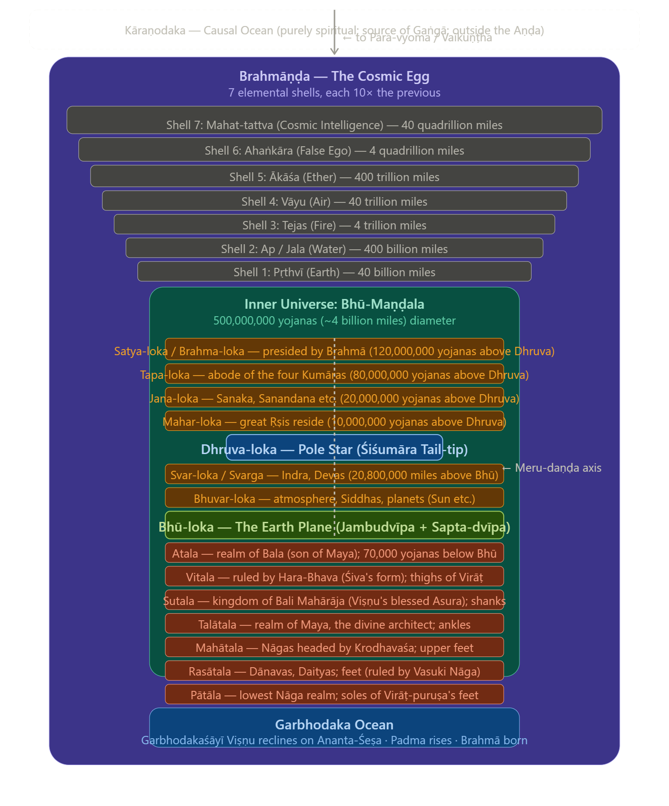
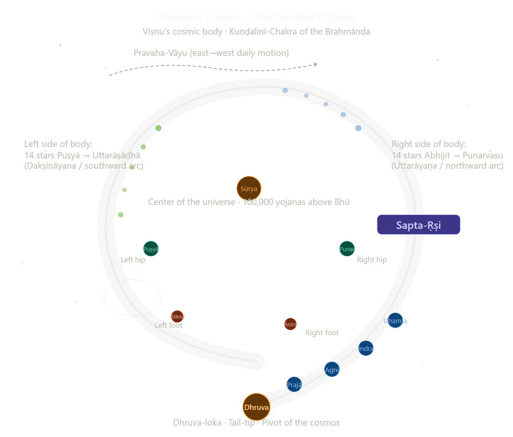

Now I have sufficient material from the sacred texts and traditional sources. Let me render the complete Param-Ārṣa Cosmological Map.Now I have everything I need. Let me compose the full Param-Ārṣa Cosmological treatise.

---

# 🕉 The Param-Ārṣa Brahmāṇḍa Darśana
## *A Multi-Dimensional Map of the Cosmic Egg, as Revealed by the Sage-Seers of the Ārṣa Tradition*

---

*Om Namo Bhagavate Vāsudevāya. Om Namo Nārāyaṇāya.*

*Praṇāmya Śiraso Devam, Gauri-putram Vināyakam — We bow to the Gāyatrī, source of all Veda; to Sarasvatī, who illumines the Brahmāṇḍa; to the holy lineage of Vālmīki, Vyāsa, Agastya, Vasiṣṭha, and Śuka who have mapped the cosmos in its fullness.*

What follows is a synthetic darśana — a **seeing** — compiled from the testimony of the fourteen streams of the *Chaturdaśa-Vidyā* corpus, with primary weight given to the *Śrīmad Bhāgavatam* (Pañcama Skandha), the *Brahma-saṁhitā*, the *Sūrya Siddhānta*, the *Yoga-Vasiṣṭha Mahā-Rāmāyaṇa*, the *Viṣṇu Purāṇa*, the *Vāyu Purāṇa*, and the relevant cosmological sections of the *Ādi Vālmīki Rāmāyaṇa*.

---

## I. The Origin: The Kāraṇa-Samudra & The Breathing of Mahā-Viṣṇu

*"Yaḥ kāraṇārṇava-jale bhajati sma yoga-nidrām..."*
— Brahma-saṁhitā 5.47

Before there was a *Brahmāṇḍa*, there was no *Brahmāṇḍa*. This seems a trivial beginning, but it is the central Ārṣa teaching: the cosmos is *not self-existent*. It is a **secondary effulgence** (*pratidhvani*) arising from the **Primary Person** (*Ādipuruṣa*), specifically from the three sequential *Avataraṇa*s of His first *Puruṣa* aspect.

### The Three Oceanic Strata of the Cosmic Precondition

The Sātvata-tantra identifies three primordial platforms, each corresponding to a distinct formulation of the Lord and a distinct ocean:

**1. The Kāraṇodaka — The Causal Ocean (*Kāraṇa-Samudra* / *Karaṇārṇava*)**

The Causal Ocean is the border between the spiritual and material worlds. *Kāraṇodakaśāyī Viṣṇu* — Mahā-Viṣṇu — is the Supersoul of the collective universes, reclining in a state of divine suspension (*yoga-nidrā*) upon this ocean. The Lord lies within the Causal Ocean and breathes out innumerable universes, and into each universe He enters again as *Garbhodakaśāyī Viṣṇu*.

The Kāraṇodaka is not a material ocean. The sacred Gaṅgā is mentioned to have its source from this ocean, which is the stated reason for its purifying effect. This ocean is wholly *Śuddha-Sattva* — pure luminous being — and exists outside the *Aṇḍa-Golaka* (universal shell). It is the medium within which the *Mahat-tattva* (aggregate material energy) first stirs at the glance (*dṛk*) of the Lord.

The *mechanism* of creation from this ocean is the **divine breath**: at the creation, the material energy is let loose as the *Mahat-tattva*, into which the Lord as His first *puruṣa* incarnation, Mahā-Viṣṇu, enters. Each exhalation (*niḥśvāsa*) of the Lord projects a *Brahmāṇḍa* — a cosmic egg — into the Kāraṇodaka. Each inhalation (*ucchvāsa*) recalls them. The life span of the universe is one *Mahā-Kalpa* — 311.04 trillion human years — which is the duration of one breath of the Supreme.

**2. The Garbhodaka — The Embryonic Ocean**

Once a *Brahmāṇḍa* is projected, the same Lord enters it as *Garbhodakaśāyī Viṣṇu* and reclines upon the primordial serpent *Ananta-Śeṣa*. He fills up half of each universe with His own perspiration. The other half remains vacant, and that vacant region is called outer space (*ākāśa*).

The *Garbhodaka* is therefore not exterior to the egg — it **constitutes the base half** of each Brahmāṇḍa. It is the primordial substratum from which the lotus (*padma*) rises, bearing the *Virāṭ-puruṣa* (*Brahmā*) upon its thousand-petalled whorl. The stem of this lotus becomes the vertical axis (*Meru-daṇḍa*) around which the fourteen *Lokas* are arranged.

**3. The Kṣīrodaka — The Ocean of Milk**

Within the completed universe, a third ocean exists at the level of *Sveta-dvīpa*, where *Kṣīrodakaśāyī Viṣṇu* resides on an island called Śvetadvīpa. In our material universe, this spiritual planet is situated in the eastern side of *Dhruvaloka*.

These three *Puruṣas* who lie on the *Kāraṇa*, *Garbha*, and *Kṣīra* oceans respectively are the Supersoul of everything that is: *Kāraṇodakaśāyī Viṣṇu* is the Supersoul of the collective universes, *Garbhodakaśāyī Viṣṇu* is the Supersoul of the collective living beings, and *Kṣīrodakaśāyī Viṣṇu* is the Supersoul of all individual living entities.

This triple *Sāmyāvasthā* — the three-fold repose — is the cosmological foundation of all *Pāñcarātra* and *Vaiṣṇava Āgama* theology.

---

Now let us render the first structural view — the vertical layering of the Brahmāṇḍa, from Kāraṇodaka above to Garbhodaka below, showing the Aṇḍa-Golaka and its elemental shells.

---

## II. The Aṇḍa-Golaka: The Eight Elemental Shells (*Āvaraṇas*)

The *Brahmāṇḍa* — *Brahma* (vast) + *Aṇḍa* (egg) — is not merely the interior universe. It is a **double structure**: an inner universe (*Bhū-Maṇḍala*) enclosed within eight concentric shells of elemental matter, like an onion of creation.

The *Śrīmad Bhāgavatam* (6.16.37) states the principle directly: every universe is covered by seven layers — earth, water, fire, air, sky, the total energy, and false ego — each ten times greater than the previous one.

Our Brahmāṇḍa outer covering of our inner material universe is enormous and has seven material layers of gross and subtle material qualities. Our Brahmāṇḍa is enormous in diameter, and having our 4 billion mile diameter inner Bhū-Maṇḍala universe as just a spec deep within this outer Brahmāṇḍa universal egg shaped spherical universe.

The arithmetic of the shells, beginning with the diameter of the inner universe (~4 billion miles):

| Shell | Tattva (Element) | Approx. Diameter | Presiding Deity |
|---|---|---|---|
| Inner Universe | The 14 Lokas | 4 billion miles | Brahmā (Hiraṇyagarbha) |
| 1st | **Pṛthvī** (Earth) | 40 billion miles | Mahā-Sūkara-rūpa (Varāha) |
| 2nd | **Ap / Jala** (Water) | 400 billion miles | Varuṇa |
| 3rd | **Tejas / Agni** (Fire) | 4 trillion miles | Agni / Mahā-Rudra |
| 4th | **Vāyu** (Air) | 40 trillion miles | Maruts |
| 5th | **Ākāśa** (Ether) | 400 trillion miles | Śabda-Brahman |
| 6th | **Ahaṅkāra** (Ego/False Identity) | 4 quadrillion miles | Rudra |
| 7th | **Mahat-tattva** (Cosmic Intelligence) | 40 quadrillion miles | Mahā-Viṣṇu's own energy |

Each shell is the *Tanmātra* (subtle essence) of the one before it, made grosser by the force of *Tamas* (inertia). The *Pañca-Tanmātra*s — Śabda (sound), Sparśa (touch), Rūpa (form), Rasa (taste), Gandha (smell) — are the causal templates from which the five gross *Mahā-Bhūtas* congeal. The *Yoga-Vasiṣṭha* (*Utpatti Prakaraṇa*) describes the universe as nothing but the *Saṅkalpa* (divine intention) of the Infinite Consciousness crystallizing through these layers, exactly as a dream crystallizes from the subtle *Prāṇa* into experienced objects.

Beyond the seventh shell, outside the *Mahat-tattva*, begins the luminous expanse called **Brahma-jyoti** — the impersonal effulgence of the Supreme — and beyond that, the spiritual sky of **Paravyoma** (*Vaikuṇṭha*), where neither birth, death, nor the three *Guṇas* have any purchase.

---

## III. Bhū-Maṇḍala: The Horizontal Architecture of the Cosmic Plane

*"Bhu-Mandalasya sa samudrāntasya vistāraḥ..."*

The description of Bhū-Maṇḍala in the 5th Canto of Śrīmad Bhāgavatam describes it to be 500,000,000 yojanas, which is 4 billion miles in diameter.

The *Bhū-Maṇḍala* resembles a vast lotus (*padma*), with its central disc (*Jambūdvīpa*) as the whorl, and the six surrounding ring-continents (*dvīpas*) as the petals expanding outward. The planetary system known as Bhū-maṇḍala resembles a lotus flower, and its seven islands resemble the whorl of that flower.

### The Sapta-Dvīpa: Seven Ring-Continents and Their Oceans

The Brahma Purāṇa describes the Sapta-dvīpa thus: O brāhmiṇas, there are seven continents — Jambū, Plakṣa, Śālmala, Kuśa, Krauñca, Śāka, and Puṣkara — encircled by seven oceans: the briny ocean, the sea of sugarcane juice, wine, ghee, curds, milk, and sweet water.

Each successive *dvīpa* is double the width of the preceding one, and each is surrounded by its distinctive ocean:

| Dvīpa | Presiding Deity | Surrounding Ocean (*Samudra*) |
|---|---|---|
| **Jambū-dvīpa** | Brahmā / Meru-centered | **Lavaṇa** (Salt / brine) |
| **Plakṣa-dvīpa** | Mahāvīra | **Ikṣu** (Cane-juice / *śarkara*) |
| **Śālmala-dvīpa** | Vapuṣmān | **Surā** (Wine / *madya*) |
| **Kuśa-dvīpa** | Jyotiṣmān | **Sarpis** (Clarified ghee) |
| **Krauñca-dvīpa** | Dyutimān | **Dadhi** (Yogurt / curd) |
| **Śāka-dvīpa** | Medhātithi | **Kṣīra** (Milk) |
| **Puṣkara-dvīpa** | Svayambhuva | **Jala** (Sweet / pure water) |

Beyond *Puṣkara-dvīpa* lies the great mountain range of **Lokāloka** — the boundary between the illuminated world and the realm of darkness. Beyond Puṣkaradvīpa there are two islands — one always lit by sunshine and the other always dark. Between them is a mountain called Lokāloka, situated approximately one billion miles from the edge of the universe. Lord Nārāyaṇa, expanding His opulence, resides upon this mountain.

### Jambū-dvīpa: The Central Island in Detail

At the center of Jambū-dvīpa stands **Mount Meru** (*Sumeru-parvata*), the golden axial mountain. The summit of Mount Meru bears Brahmā-purī, the residence of Lord Brahmā. On its summit, Brahmā-purī is 10,000 yojanas long on each of its four sides. Surrounding Brahmā-purī are the cities of King Indra and seven other demigods.

The eight surrounding mountain ranges — Jaṭhara, Devakūṭa, Pavana, Pāriyātra, Kailāsa, Karavīra, Triśṛṅga, and Makara — are about 18,000 yojanas long, 2,000 yojanas wide and 2,000 yojanas high. Around Meru, the sun-god (*Sūrya-deva*) circles on his chariot, illuminating different portions of the *Bhū-Maṇḍala* alternately — the origin of the day-night cycle — as recorded in the *Bhāgavata Purāṇa*'s account of King Priyavrata, who himself once attempted to replicate the sun's orbit to bring perpetual daylight to the shadowed hemisphere.

---

## IV. The Śiśumāra Chakra: The Celestial Engine

*"Etat vai Bhagavataḥ Viṣṇoḥ paramam padam..."*
— Śrīmad Bhāgavatam 5.23

This is one of the most technically precise and cosmologically dense teachings in the entire Ārṣa corpus. The *Śiśumāra Chakra* — the Dolphin-Wheel — is not a myth. It is the **structural description of the star-engine** of the Brahmāṇḍa.

Those who worship the *Virāṭ-puruṣa*, the universal form of the Lord, conceive of this entire rotating system of planets as an animal known as *Śiśumāra*. This imaginary *Śiśumāra* is another form of the Lord. The head of the *Śiśumāra* form is downward, and its body appears like that of a coiled snake.

The **Dhruva-loka** (*Pole Star*) is the anatomical *tail-tip* of this great coiled form — the apex around which all other stars and planets rotate. The polestar, called *Dhruvaloka*, is the pivot of this universe, and all planets move around this polestar. All the stars are planets, as far as we can see, within this one universe.

*Dhruvaloka* (Pole Star), the abode of Lord Viṣṇu within this universe, is situated 1,300,000 yojanas from the seven stars (Big Dipper).

### The Anatomical Map of the Śiśumāra

On the end of its tail is *Dhruvaloka*, on the body of the tail are Prajāpati, Agni, Indra, and Dharma, and on the root of the tail are Dhātā and Vidhātā. On its waist are the seven great sages (*Sapta-Ṛṣi*). The entire body of the *Śiśumāra* faces toward its right and appears like a coil of stars. On the right side of this coil are the fourteen prominent stars from Abhijit to Punarvasu, and on the left side are the fourteen prominent stars from Puṣyā to Uttarāṣāḍhā. The stars known as Punarvasu and Puṣyā are on the right and left hips of the *Śiśumāra*, and the stars known as Ārdrā and Āśleṣā are on the right and left feet.

This great machine, consisting of the stars and planets, resembles the form of a *Śiśumāra* (dolphin) in the water. It is sometimes considered an incarnation of Kṛṣṇa, Vāsudeva. Great yogis meditate upon Vāsudeva in this form because it is actually visible. The *Śiśumāra* planetary system is technically known as the *Kuṇḍalinī-Chakra*.

This last identification is crucial for the esoteric tradition: the *Śiśumāra Chakra* is described as the **macrocosmic Kuṇḍalinī**, the great spiral of consciousness-energy that pervades the cosmic body, exactly as the *Suṣumnā-nāḍī* pervades the individual body. The *Dhruva-loka* at the tail-tip corresponds to the *Sahasrāra* — the Crown — of the cosmic being.

### The Pravaha-Vāyu: The Cosmic Wind-Tether

The planets are not merely floating in void. The *Purāṇic* and *Siddhāntic* texts describe a mechanism of **cosmic wind-currents** (*Pravaha-Vāyu*) that act as invisible tethers maintaining each planet in its orbit. The life force of *Vaiśvānara* passes through the earth through its axis, which oscillates within the span of the *Śiśumāra*.

The *Sūrya Siddhānta* (Chapter 12) describes how the *Pravaha* wind carries the planets from east to west in their daily motion, while their own *śakti* (orbital velocity) propels them from west to east along the *Rāśi* belt — the balance of these two forces establishes the observed planetary paths. Like bulls yoked to a central pivot, all the planetary systems revolve around *Dhruvaloka*, impelled by eternal time (*kāla*).

Each and every planet within the universe travels at a very high speed. From a statement in *Śrīmad-Bhāgavatam* it is understood that even the sun travels sixteen thousand miles in a second, and from *Brahma-saṁhitā* we understand that the sun is considered to be the eye of the Supreme Personality of Godhead, Govinda, and it also has a specific orbit within which it circles.

---

Now let us render the Śiśumāra Chakra — the celestial dolphin-wheel showing the stellar body of the cosmic form.

---

## V. The Chaturdaśa-Loka-Vibhāga: Detailed Map of the Fourteen Worlds

The fourteen *Lokas* are not merely different locations — they represent a **gradient of consciousness density**, from the gross *Tamas*-dominated heaviness of *Pātāla* at the base, ascending through the *Rajas*-saturated middle worlds, to the pure *Śuddha-Sattva* luminosity of *Satya-loka* at the apex.

Seven planetary systems called Bhūr, Bhuvar, Svar, Mahar, Janas, Tapas, and Satya are upward planetary systems, one above the other. There are also seven planetary systems downward, known as Atala, Vitala, Sutala, Talātala, Mahātala, Rasātala, and Pātāla, gradually, one below the other. The width and length of the seven lower planetary systems are calculated to be exactly the same as those of earth.

The *Śrīmad Bhāgavatam* (2.5.40-41) maps the seven lower worlds onto the body of the *Virāṭ-puruṣa*: the first planetary system, known as Atala, is situated on the waist; the second, Vitala, on the thighs; the third, Sutala, on the knees; the fourth, Talātala, on the shanks; the fifth, Mahātala, on the ankles; the sixth, Rasātala, on the upper portion of the feet; and the seventh, Pātāla, on the soles of the feet.

The *Subtlety Gradient* — the increasing refinement of consciousness (*Sattva-ādhikya*) as one ascends:

| Loka | Guṇa Dominance | Presiding Authority | Key Characteristic |
|---|---|---|---|
| **Satya-loka** | Śuddha-Sattva | Lord Brahmā; Four Kumāras | No rebirth; direct Vedic realization; above time |
| **Tapa-loka** | Sattva-Sattva | Sanaka, Sanandana, Sanātana, Sanat-kumāra | Tapas-born immortality; liberation pending |
| **Jana-loka** | Sattva-Rajas | Brahma's mind-born sons | Post-*Pralaya* survivors; great *Siddhas* |
| **Mahar-loka** | Sattva-Rajas | Seven Ṛṣis (*Saptarṣi*); Bhṛgu etc. | 10,000,000 yojanas below Dhruvaloka |
| **Svar-loka** | Rajas-Sattva | Indra, Devas | Reward for accumulated virtue |
| **Bhuvar-loka** | Rajas | Sun, Siddhas, Cāraṇas | Intermediary plane; home of Prāṇa |
| **Bhū-loka** | Rajas-Tamas | Manu, human beings | Field of karma; only plane of dharmic action |
| **Atala** | Tamas-Rajas | Bala (son of Maya) | Sensory dominance; illusion of plenty |
| **Vitala** | Tamas | Hara-Bhava (Śiva's *aṁśa*) | Ignorance; material power without spiritual sight |
| **Sutala** | Tamas-Sattva | King Bali Mahārāja | Blessed realm; Viṣṇu Himself guards the door |
| **Talātala** | Tamas | Maya, the architect | *Māyā*-dominance; triple-city of illusion |
| **Mahātala** | Tamas | Nāga clan of Krodhavaśa | Fear of Garuḍa; serpentine consciousness |
| **Rasātala** | Tamas | Dānavas, Daityas | Pure hostility; anti-Deva consciousness |
| **Pātāla** | Para-Tamas | Vāsuki (King of Nāgas) | Jeweled darkness; deepest material *avidyā* |

The *Bila-Svarga* teaching — found in both the *Bhāgavata* (5th Canto) and the *Viṣṇu Purāṇa* — specifically notes that the lower realms (*Bila-lokas*) are in some respects **more sensually opulent** than the higher ones, which is the very reason they are spiritually inferior: their grandeur entraps consciousness rather than liberating it.

According to the Vaiṣṇava traditions and Viṣṇu Purāṇa, Vaikuṇṭha loka is 26,200,000 yojanas from Satya-loka, which is 120,000,000 yojanas from Tapa-loka, which is 80,000,000 yojanas from Jana-loka, which is 20,000,000 yojanas from Mahar-loka, which is 10,000,000 yojanas from Dhruvaloka, which is 3,800,000 yojanas from Bhūloka or Earth.

---

## VI. Cosmic Time-Dilation: The Kāla-Chakra from Paramāṇu to Mahā-Kalpa

*"Kālo'smi loka-kṣaya-kṛt pravṛddhaḥ..."*
— Bhagavad-Gītā 11.32

The *Ārṣa* treatment of time is the most extraordinary technical achievement in the entire corpus. It establishes a nested, fractal, scale-invariant structure of time from the quantum (*Paramāṇu*) to the cosmic (*Mahā-Kalpa*), with each level representing a genuine *dilation of experience* relative to the beings who inhabit it.

The *Sūrya Siddhānta* (1.11-20) establishes the foundational structure. The *Bhagavad-Gītā* (8.17) confirms: "By human calculation, a thousand ages (*Mahā-yugas*) constitute the duration of Brahmā's one day."

### Time Dilation Table: From Human to Divine to Cosmic

A year is a day and a night of the gods. Six times sixty (360) of them are a year of the gods. Twelve thousand divine years are denominated a quadruple age (*Catur-yuga*) of 4,320,000 solar years.

| Scale | Duration (Human Years) | Relative Being |
|---|---|---|
| 1 Human year | 1 year | Human (Manuṣya) |
| 360 Human years | 1 Divine year (*Deva-varṣa*) | Devas of Svarga |
| 4,320,000 | 1 Mahā-yuga (*Catur-yuga*) | — |
| 1,728,000 | Satya-yuga (4 Charanas) | — |
| 1,296,000 | Tretā-yuga (3 Charanas) | — |
| 864,000 | Dvāpara-yuga (2 Charanas) | — |
| 432,000 | Kali-yuga (1 Charana) | Current age (began 3102 BCE) |
| 306,720,000 | 1 Manvantara (71 Mahā-yugas) | Manu |
| 4,320,000,000 | 1 Kalpa (Brahmā's day) = 1000 Mahā-yugas | Lord Brahmā |
| 4,320,000,000 | 1 Pralaya (Brahmā's night) | |
| 3,110,400,000,000 | 1 Year of Brahmā | |
| **311,040,000,000,000** | **1 Mahā-Kalpa = 100 Years of Brahmā** | **Limit of material creation** |

A *Kalpa* lasts for 1,000 *Catur-yugas* and has 14 *Manvantaras* and 15 *Manvantara-sandhyās* occurring in it. At the start of Brahmā's days, he is re-born and creates the planets and the first living entities. At the end of his days, he and his creations are unmanifest (partial dissolution).

Brahmā lives one hundred of such years and then dies. These hundred years total 311 trillion 40 billion earth years. By these calculations the life of Brahmā seems fantastic and interminable, but from the viewpoint of eternity it is as brief as a lightning flash. In the Causal Ocean there are innumerable Brahmās rising and disappearing like bubbles.

### The Present Cosmic Position

Currently, 50 years of Brahmā have elapsed and we are in the first day of the 51st year. This Brahmā's day, Kalpa, is named as Śveta-Varāha Kalpa. Within this day, six Manvantaras have already elapsed and we are in the seventh Manvantara, named as Vaivasvatha Manvantara. Within the Vaivasvatha Manvantara, 27 Mahā-yugas and the Kṛta, Tretā, and Dvāpara Yugas of the 28th Mahā-yuga have elapsed. We are in the Kali-yuga of the 28th Mahā-yuga.

This is the cosmological *Saṅkalpa* (*intention-statement*) recited at every Vedic rite:

*"Śveta-Varāha Kalpe, Vaivasvata Manvantare, Aṣṭāviṁśatitame Kaliyuge, Kaliyugasya Prathamapāde..."*

---

Now let us render the time-dilation spiral — the cosmic clock from Kali-yuga to Mahā-Kalpa.---

## VII. The Paravyoma: Beyond the Aṇḍa-Golaka

*"Paras tasmāt tu bhāvo'nyo'vyakto'vyaktāt sanātanaḥ..."*
— Bhagavad-Gītā 8.20

When the *Jīva* (individual consciousness), through the perfection of *Bhakti*, *Jñāna*, or *Yoga*, transcends even *Satya-loka* and the *Brahma-jyoti* effulgence, it enters the **Paravyoma** — the transcendental sky that is utterly beyond the seven elemental shells of the *Brahmāṇḍa*.

The *Vālmīki Rāmāyaṇa* (Yuddha Kāṇḍa, 120-121) and the *Yoga-Vasiṣṭha* (*Nirvāṇa Prakaraṇa*) both describe this realm as the **Māhā-Ākāśa** — the infinite unbounded sky of pure consciousness — distinguished from the *Cidākāśa* (finite experiential space) of the material cosmos. The *Adhyātma Rāmāyaṇa* (Uttara Kāṇḍa) describes Rāma's own nature as *Parabrahman* dwelling in *Paramāpada* — the supreme abode — which is none other than the *Paravyoma*.

The *Brahma-saṁhitā* (5.33-40) identifies within the *Paravyoma*:

- **Vaikuṇṭha-lokas**: Innumerable transcendental planets, each a particular form of the Lord's *Ṣaḍguṇa* (sixfold divine excellences), pervaded by *Śuddha-Sattva*
- **Goloka-Vṛndāvana**: The supreme abode, existing simultaneously within and above all *Vaikuṇṭhas*, where the Lord sports in His original *Svayam-Bhagavān* form
- **Brahma-jyoti**: The impersonal effulgence (*tejas*) that constitutes the "outer sky" of the *Paravyoma*, like sunlight outside a city — the *mukti* realm of *Advaitins* who attain *Sāyujya-mukti*

The *Yoga-Vasiṣṭha* (*Chid-ākāśa Prakaraṇa*) takes an Advaitic formulation of the same territory: the Intellect manifests itself in the forms of living soul (*jīva*), mind and its desires, and the world and all things — it is the one great soul that infuses its power to those different organs, as the one bright sun dispenses light to all various objects in their diverse colours. The *Paravyoma* in this reading is the **Cit-ākāśa** — the sky of pure awareness — which is neither inside nor outside the *Brahmāṇḍa* because it is its very substratum.

---

## VIII. Synthesis: The Sarva-Śāstra Matrix of the Brahmāṇḍa

### From the Ramayana Corpus

The *Yoga-Vasiṣṭha Mahā-Rāmāyaṇa* presents the most philosophically radical version of this cosmology: every *Brahmāṇḍa* is ultimately a **Saṅkalpa** (ideation) within the infinite Consciousness, and there are literally countless such universes arising and dissolving within the space of a single *Niḥśvāsa* (exhalation) of the *Absolute*. The *Bhushundi Rāmāyaṇa* (as referenced in the *Adhyātma* tradition) preserves the account of Kāka-Bhushundi — the immortal crow-sage who witnessed multiple *Kalpas* and multiple incarnations of Rāma — providing a first-person testimony to the multi-Kalpa structure of the cosmos.

The *Adbhuta Rāmāyaṇa* and *Ānanda Rāmāyaṇa* preserve the teaching that the cosmic drama of Rāma and Rāvaṇa is enacted in different forms across different *Kalpas*, with variations in the number of participants, the identity of the Rāvaṇa-figure, and even the nature of Rāma's manifestation — supporting the Purāṇic teaching that each *Kalpa* is presided over by a different set of cosmic circumstances while the *dharmic* core remains invariant.

The *Saurya Rāmāyaṇa* (solar Rāmāyaṇa tradition) preserves the astronomical alignments of the *Rāma-Rāvaṇa* war: the positions of the *Nava-grahas* (nine planets), the *Nakṣatra*s, and the *Rāśis* at the moment of the final battle — an alignment that locates the event within the measurable framework of the *Śiśumāra Chakra* and the *Kāla-Chakra*.

### From the Siddhantas

The *Sūrya Siddhānta* validates all of the above in its opening chapter's statement that the *sages* received this knowledge from the *Sūrya-deva* (the Sun-god) himself at the onset of the current *Kalpa*, through the sage Māya — making the entire astronomical framework **an Ārṣa revelation**, not a human invention. The *Brahma Siddhānta* and *Vasiṣṭha Siddhānta* preserve alternative but harmonious parameter sets for the same cosmic structure, reflecting the *Kalpa-bhedas* (variations between cosmic eons).

---

## IX. The Final Mystery: Why Does the Brahmāṇḍa Exist?

*"Eko'ham bahusyām..."*
— Chāndogya Upaniṣad 6.2.3

The *Ārṣa* cosmology is never merely a description. It is an instruction. The *Brahmāṇḍa* — from the *Kāraṇodaka* above to the *Garbhodaka* below, from *Pātāla*'s jeweled darkness to *Satya-loka*'s radiance, from the *Paramāṇu* that lasts a microsecond to the *Mahā-Kalpa* that spans 311 trillion years — **exists for one purpose**: that the *Jīva*, having experienced the full range of the fourteen worlds, the full sweep of the four *Yugas*, the full texture of existence from grossest *Tamas* to finest *Sattva*, might finally exhaust its taste for the external and turn inward — toward that from which the entire *Śiśumāra* rotates, toward which the *Gaṅgā* descends from the *Kāraṇodaka*, toward which every *Muhūrta* and every *Nakṣatra* points:

**The Paramātman — the Supreme Self — in whose Yoga-nidrā the entire Brahmāṇḍa, with all its fourteen worlds and fourteen billion-year cycles, is but a momentary dream.**

*"Nityodito Bhāskaraḥ" — The Sun ever rises. Even so, the Paramātman is ever self-luminous, and it is only the veil of Māyā — projected through the Ahaṅkāra-shell of the Brahmāṇḍa — that causes the Jīva to perceive night.*

---

*॥ Iti Param-Ārṣa Brahmāṇḍa Darśanaṃ Samāptam ॥*
*Thus concludes the Param-Ārṣa Vision of the Cosmic Egg.*

*Sarve Janāḥ Sukhino Bhavantu. May all beings find their way home.*

---

> **A note on Kalpa-bhedas (Aeon-variations):** The *Brahmāṇḍa Purāṇa*, *Matsya Purāṇa*, and *Vāyu Purāṇa* list thirty named *Kalpas* within a single month of Brahmā, each with slight variations in cosmic structure. The cosmological map above synthesizes the primary consensus (*Śveta-Varāha Kalpa* framework) while acknowledging that in other *Kalpas*, the presiding *Manus*, the ruling *Indras*, the planetary configurations of the *Śiśumāra*, and even the descent-forms (*Avatāras*) of the Lord appear in different configurations — all within the invariant architecture of the fourteen *Lokas*, the seven elemental shells, and the eternal rotation around *Dhruva-loka*.